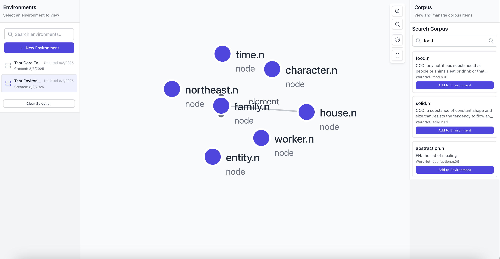

# Arbitrarium -- An interactive simulation of lexical relationships.

Arbitrarium is a web app for simulating stateful entities (dictionary nouns) by applying lexical relationships found in [WordNet](https://wordnet.princeton.edu) and [FrameNet](http://framenet.icsi.berkeley.edu).

